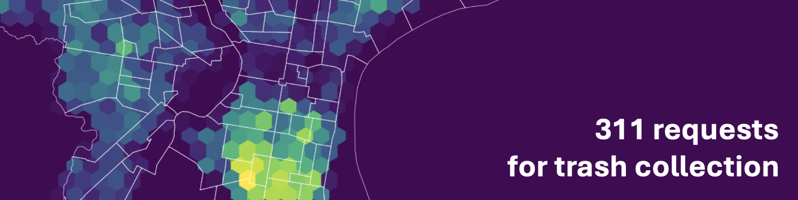

# Geospatial data analysis
## choropleth and interactive mapping
Sep 26 and October 10

### Topics
- Visualizing geospatial data
- Interactive web maps with Folium

### Readings
- [GeoPandas](http://geopandas.org/)
  - [Choropleth Maps](https://geopandas.org/en/latest/docs/user_guide/mapping.html)
  - [Classification Schemes](https://pysal.org/mapclassify/api.html)
- [Folium ](https://python-visualization.github.io/folium/index.html)

### References
- [HoloViews user guide](http://holoviews.org/user_guide/index.html) and [gallery](http://holoviews.org/gallery/index.html)
- [GeoViews user guide](http://geoviews.org/user_guide/index.html) and [gallery](http://geoviews.org/gallery/index.html)
- [Folium user guide](https://python-visualization.github.io/folium/latest/user_guide.html)
